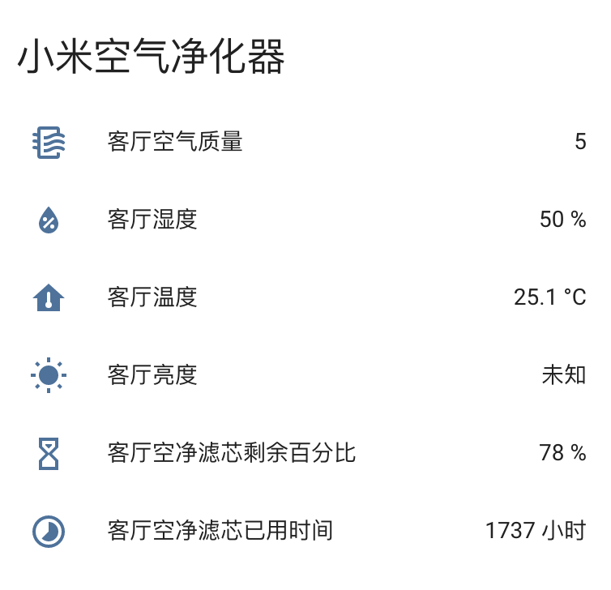

# Home Assistant 小米空气净化器组件

提供以下传感器属性

- 空气质量
- 湿度
- 温度
- 亮度
- 滤芯剩余百分比
- 滤芯已用小时数

提供以下服务

- 打开空气净化器
- 关闭空气净化器
- 设置空气净化器模式
- 设置空气净化器LED



## 安装

1. 将目录 ```[custom_components]``` 下的 ```[mi_air_purifier]``` 文件夹及文件夹下所有文件复制到 ```你的[custom_components]``` 下
2. 将目录 ```[packages]``` 下的 ```mi_air_purifier.yaml``` 文件复制到 ```你的[packages]``` 下
3. 获取小米空气净化器 IP 及 Token 并修改 ```mi_air_purifier.yaml``` 文件
4. 修改 ```你的customize.yaml``` 文件，增加 ```customize.yaml``` 中的内容，```customize.yaml``` 中的内容可自行调整
5. 重启 HA 服务
