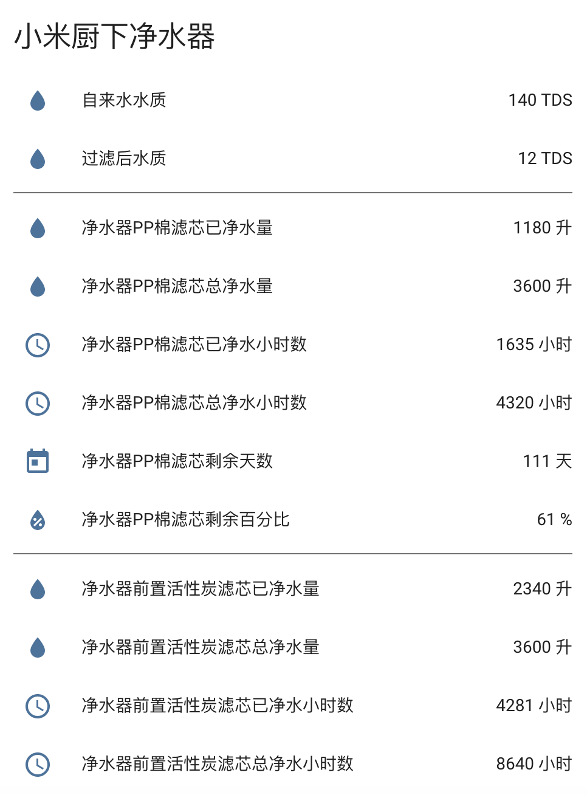

# Home Assistant 小米厨下净水器组件



## 安装

1. 将目录 [custom_components] 下的 [mi_kitchen_water_purifier] 文件夹及文件夹下所有文件复制到你的 [custom_components] 下
2. 将目录 [packages] 下的 ```mi_kitchen_water_purifier.yaml``` 文件复制到你的 [packages] 下
3. 获取小米厨下净水器 IP 及 Token 并修改 ```mi_kitchen_water_purifier.yaml``` 文件
4. 修改 ```你的customize.yaml``` 文件，增加 ```customize.yaml``` 中的内容
5. 重启 HA 服务

## 参考

基于看到现在使用量最大的小米净水器组件 [https://github.com/bit3725/homeassistant-mi-water-purifier](https://github.com/bit3725/homeassistant-mi-water-purifier) 修改，调整如下

- 将滤芯剩余天数与剩余百分比拆分为2个 Sensor
- 每种滤芯增加了新的属性：已净水量、已净水小时数、总净水量、总净水小时数