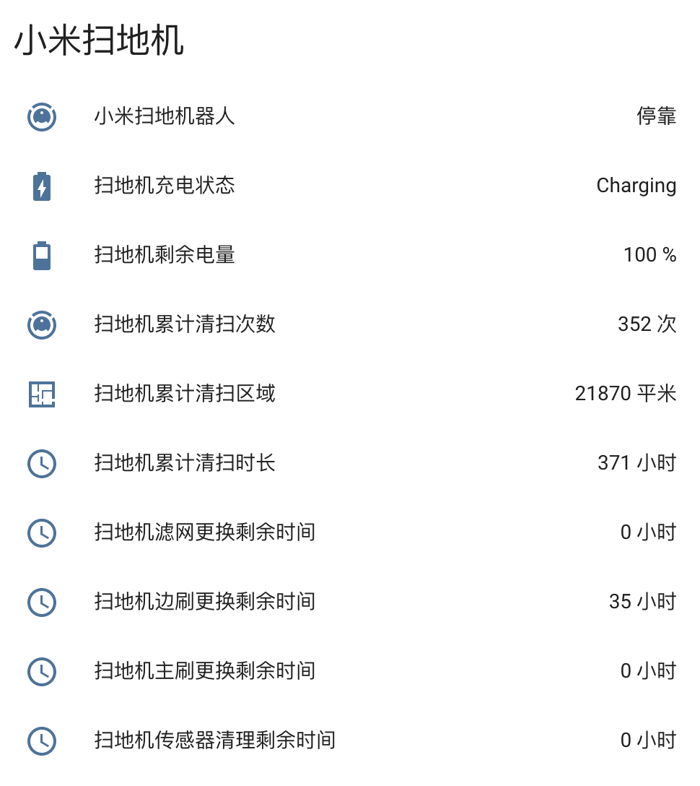

# Home Assistant 小米扫地机器人组件



## 安装

1. 将目录 [packages] 下的 ```mi_vacuum_cleaner.yaml``` 文件复制到你的 [packages] 下
2. 获取小米扫地机器人 IP 及 Token 并修改 ```mi_vacuum_cleaner.yaml``` 文件
3. 修改 ```你的customize.yaml``` 文件，增加 ```customize.yaml``` 中的内容
4. 重启 HA 服务