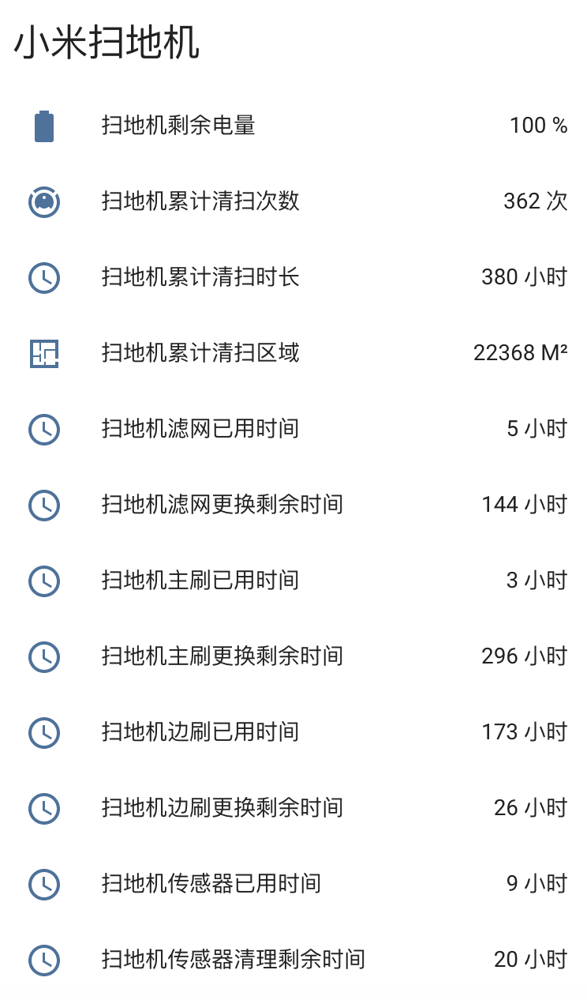

# Home Assistant 小米扫地机器人组件

扫地机提供官方的功能，额外提供了以下传感器属性

- 剩余电量
- 累计清扫次数
- 累计清扫时长
- 累计清扫区域
- 滤网已用时间
- 滤网更换剩余时间
- 主刷已用时间
- 主刷更换剩余时间
- 边刷已用时间
- 边刷更换剩余时间
- 传感器已用时间
- 传感器清理剩余时间



## 安装

1. 将目录 ```[custom_components]``` 下的 ```[mi_vacuum_cleaner]``` 文件夹及文件夹下所有文件复制到 ```你的[custom_components]``` 下
1. 将目录 ```[packages]``` 下的 ```mi_vacuum_cleaner.yaml``` 文件复制到你的 ```[packages]``` 下
2. 获取小米扫地机器人 IP 及 Token 并修改 ```mi_vacuum_cleaner.yaml``` 文件
3. 修改 ```你的customize.yaml``` 文件，增加 ```customize.yaml``` 中的内容，```customize.yaml``` 中的内容可自行调整
4. 重启 HA 服务