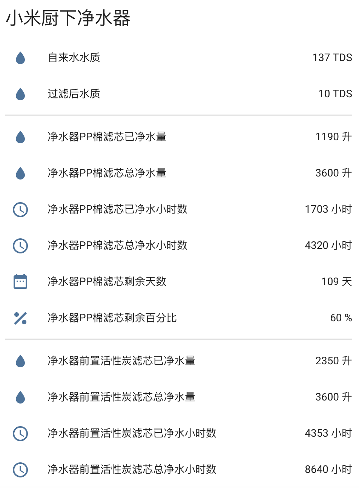

# Home Assistant 小米净水器组件

因为净水器无法远程控制，所以只提供以下传感器属性

- 净化前水质
- 净化后水质
> 以下属性每种滤芯（PP棉、前置活性炭、RO反渗透、后置活性炭）都有各自的一套
- 已净化水量
- 总可净化水量
- 已净化小时数
- 总可净化小时数
- 剩余天数
- 剩余百分比



## 安装

1. 将目录 ```[custom_components]``` 下的 ```[mi_water_purifier]``` 文件夹及文件夹下所有文件复制到 ```你的[custom_components]``` 下
2. 将目录 ```[packages]``` 下的 ```mi_water_purifier.yaml``` 文件复制到 ```你的[packages]``` 下
3. 获取小米净水器 IP 及 Token 并修改 ```mi_water_purifier.yaml``` 文件
4. 修改 ```你的customize.yaml``` 文件，增加 ```customize.yaml``` 中的内容，```customize.yaml``` 中的内容可自行调整
5. 重启 HA 服务

## 参考

基于看到现在使用量最大的小米净水器组件 [https://github.com/bit3725/homeassistant-mi-water-purifier](https://github.com/bit3725/homeassistant-mi-water-purifier) 修改，调整如下

- 去除了净水器属性，反正也不能控制，其实和净化后水质属性是一样的
- 将滤芯剩余天数与剩余百分比拆分为2个 Sensor
- 每种滤芯增加了新的属性：已净化水量、已净化小时数、总可净化水量、总可净化小时数